<div align="center">
  
</div>

<div align="center">
  <a href="https://github.com/VarunVashisth?tab=followers"></a>
  
</div>

<br />

## `> whoami`

```python
class Varun:
    role = "Developer & AI Explorer"
    code = ["Python", "Java", "JavaScript", "TypeScript"]
    interests = ["Artificial Intelligence", "Machine Learning", "Web Development"]
    current_mission = "Turning ambitious ideas into useful software"

    def say_hi(self):
        return "Thanks for dropping by — let's build something remarkable."
```

I enjoy working where **intelligent systems meet thoughtful interfaces** — experimenting, learning fast, and shipping ideas that feel useful. My toolbox spans backend logic, machine learning, and modern web experiences.

<br />

## Tech constellation

<div align="center">

### Languages


### AI, web & data


### Tools & platforms


</div>

<br />

## Current coordinates

- 🧠 Exploring practical **AI/ML** and the systems that make it useful
- ⚛️ Crafting responsive experiences with **React** and modern JavaScript
- ☕ Building solid foundations with **Java** and clean architecture
- 🐍 Automating ideas and solving problems with **Python**
- 🌱 Always learning, always iterating, always open to collaboration

<br />

## GitHub telemetry

<div align="center">
  <picture>
    <source media="(prefers-color-scheme: dark)" srcset="https://github-readme-stats.vercel.app/api?username=VarunVashisth&show_icons=true&hide_border=true&bg_color=00000000&title_color=a78bfa&icon_color=22d3ee&text_color=cbd5e1&rank_icon=github" />
    
  </picture>
  <picture>
    <source media="(prefers-color-scheme: dark)" srcset="https://github-readme-stats.vercel.app/api/top-langs/?username=VarunVashisth&layout=compact&hide_border=true&bg_color=00000000&title_color=a78bfa&text_color=cbd5e1&langs_count=8" />
    
  </picture>
</div>

<div align="center">
  <picture>
    <source media="(prefers-color-scheme: dark)" srcset="https://github-readme-streak-stats.herokuapp.com?user=VarunVashisth&hide_border=true&background=00000000&stroke=334155&ring=A78BFA&fire=22D3EE&currStreakLabel=A78BFA&sideLabels=CBD5E1&currStreakNum=F8FAFC&sideNums=F8FAFC&dates=64748B" />
    
  </picture>
</div>

<br />

## Contribution orbit

<div align="center">
  <picture>
    <source media="(prefers-color-scheme: dark)" srcset="https://raw.githubusercontent.com/VarunVashisth/VarunVashisth/output/github-contribution-grid-snake-dark.svg" />
    
  </picture>
</div>

<br />

<div align="center">
  <a href="https://github.com/VarunVashisth?tab=repositories">
    
  </a>
  <br /><br />
  <sub>Ideas → experiments → useful things.</sub>
</div>
