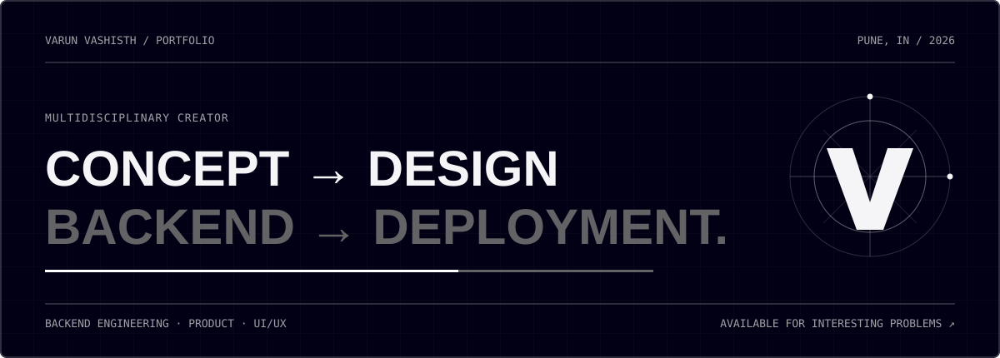

  

  <a href="https://varunvashisth.in"><b>PORTFOLIO</b></a>
  &nbsp;&nbsp;·&nbsp;&nbsp;
  <a href="https://www.linkedin.com/in/varun-vashisth-a17b08290"><b>LINKEDIN</b></a>
  &nbsp;&nbsp;·&nbsp;&nbsp;
  <a href="https://www.youtube.com/@Varizz2006"><b>YOUTUBE</b></a>
  &nbsp;&nbsp;·&nbsp;&nbsp;
  <a href="https://www.behance.net/varunvashisth"><b>BEHANCE</b></a>

 

## `00 // PROFILE`

### Backend engineer with a designer's eye.

I build APIs, developer tools, and digital products from the system underneath to the interface on top. My work sits between **backend engineering**, **product thinking**, and **visual design**: reliable enough to ship, clear enough to use, and considered enough to remember.

> **Currently** — ECE at IIIT Nagpur, focused on backend engineering, developer tooling, and product design.
>
> **Building** — Systems that remove friction instead of adding another dashboard.
>
> **Belief** — Good engineering and good design are the same conversation.

 

## `01 // FEATURED PRODUCT`

### [RequestVault](https://requestvault-ten.vercel.app/)

> API observability without the log-digging ritual.

  <a href="https://requestvault-ten.vercel.app/"><b>LIVE PRODUCT ↗</b></a>
  &nbsp;&nbsp;·&nbsp;&nbsp;
  <a href="https://github.com/VarunVashisth/RequestVault"><b>SOURCE ↗</b></a>
  &nbsp;&nbsp;·&nbsp;&nbsp;
  <a href="https://pypi.org/project/requestvault/"><b>PYPI ↗</b></a>

RequestVault watches outbound Python HTTP requests and turns them into a clean stream of responses, failures, latency, and usage data. The product combines a lightweight Python SDK with a full analytics platform, built to make debugging third-party APIs considerably less painful.

`Python SDK` &nbsp; `FastAPI` &nbsp; `SQLAlchemy` &nbsp; `React` &nbsp; `TypeScript` &nbsp; `PostgreSQL` &nbsp; `Redis`

 

## `02 // SELECTED SYSTEMS`

### `02.1` [Drixx](https://github.com/VarunVashisth/Death_Notifier-)

Local-first attention system that turns activity, idle time, and daily intentions into honest feedback.

`Rust` &nbsp; `Tauri` &nbsp; `React` &nbsp; `SQLite`

---

### `02.2` [Twizz](https://github.com/VarunVashisth/twizz)

Human-in-the-loop editorial pipeline for discovering, verifying, and shaping technical ideas.

`Python` &nbsp; `FastAPI` &nbsp; `SQLite` &nbsp; `LLMs`

---

### `02.3` [Varizz AI](https://github.com/VarunVashisth/Varizz)

Private, self-hosted personal assistant built around voice, local execution, and deep personalization.

`Electron` &nbsp; `Python` &nbsp; `Ollama` &nbsp; `LLMs`

---

### `02.4` [TARIZZ](https://github.com/VarunVashisth/Tarizz)

Encrypted desktop workspace for projects, notes, flowcharts, planning, and private journaling.

`Python` &nbsp; `PyQt6` &nbsp; `SQLite` &nbsp; `Cryptography`

---

### `02.5` [Disputo](https://disputo.vercel.app/)

Interactive AI debate simulator for testing arguments and exploring opposing perspectives.

`React` &nbsp; `JavaScript` &nbsp; `Groq`

---

### `02.6` [CATCH.PNG](https://catch-png.vercel.app/)

A tiny web game about catching a pixel that has no intention of cooperating.

`HTML` &nbsp; `CSS` &nbsp; `JavaScript`

 

## `03 // COMPETENCY MATRIX`

<strong>Backend</strong> 
Python · FastAPI · API design · Authentication · PostgreSQL · Redis · System design

<strong>Product engineering</strong> 
TypeScript · JavaScript · React · Desktop apps · Performance · Prototyping

<strong>AI and data</strong> 
LLM integrations · Ollama · PyTorch · TensorFlow · scikit-learn

<strong>Design</strong> 
UI/UX · Design systems · Figma · Typography · Visual identity · Motion

<strong>Tools</strong> 
Git · Docker · Linux · Tauri · Electron · PyQt6 · Adobe Creative Suite

The overlap is intentional. When I design an interface, I am already thinking about the API response and database shape behind it. When I build a backend, I am thinking about how latency, errors, and state will feel to the person using it.

 

## `04 // SIGNAL`

  <picture>
    <source media="(prefers-color-scheme: dark)" srcset="https://github-readme-stats.vercel.app/api?username=VarunVashisth&show_icons=true&hide_border=true&hide_title=true&bg_color=020015&text_color=A1A1A6&icon_color=F5F5F7&ring_color=F5F5F7" />
    
  </picture>
  <picture>
    <source media="(prefers-color-scheme: dark)" srcset="https://github-readme-stats.vercel.app/api/top-langs/?username=VarunVashisth&layout=compact&hide_border=true&hide_title=true&bg_color=020015&text_color=A1A1A6&langs_count=6" />
    
  </picture>

 

  <picture>
    <source media="(prefers-color-scheme: dark)" srcset="https://raw.githubusercontent.com/VarunVashisth/VarunVashisth/output/github-contribution-grid-snake-dark.svg" />
    
  </picture>

---

  <code>05 // CONNECTION</code>
  <h3>Have a product concept or a systems problem worth obsessing over?</h3>
  <a href="mailto:varunvashisth2006@gmail.com"><b>LET'S BUILD SOMETHING →</b></a>
    
  Designed and engineered by Varun Vashisth · Pune, India

